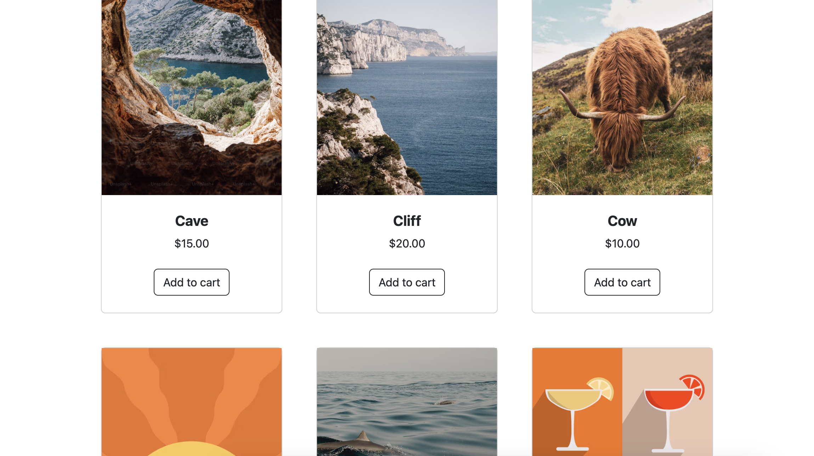
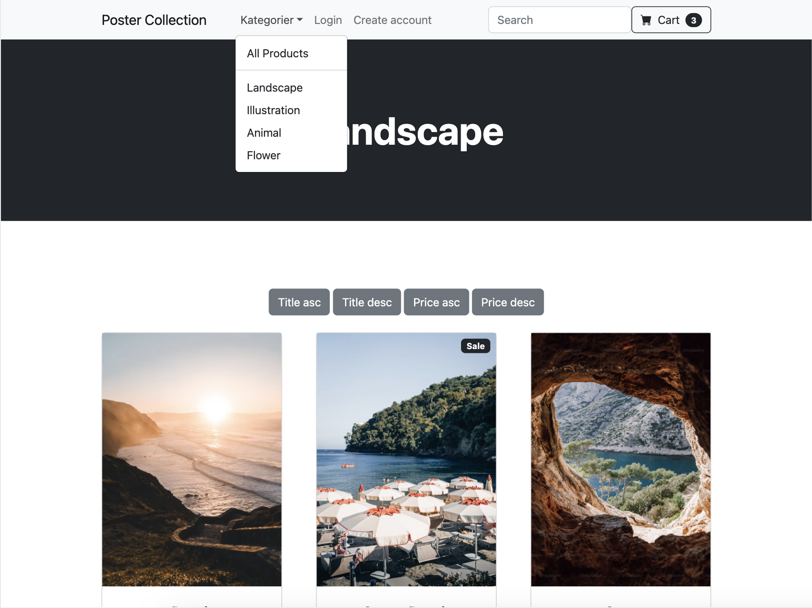
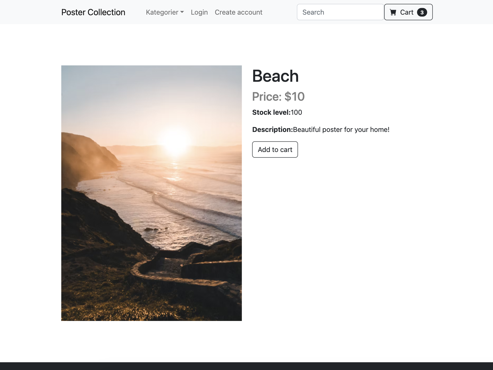
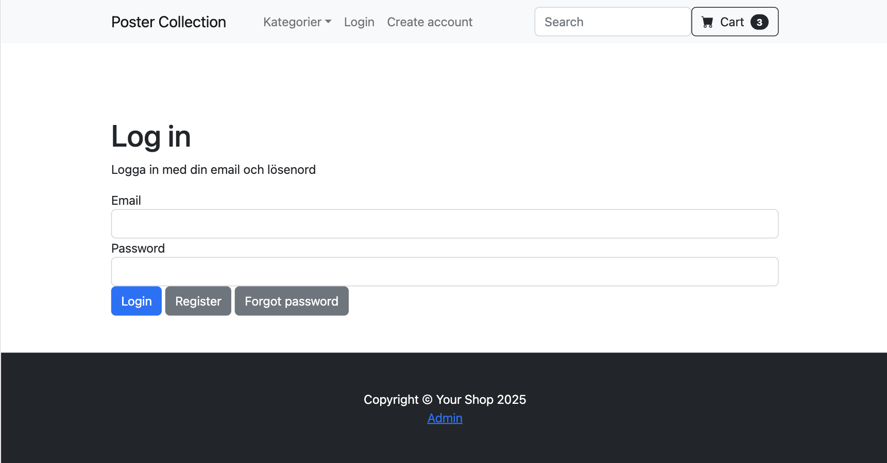
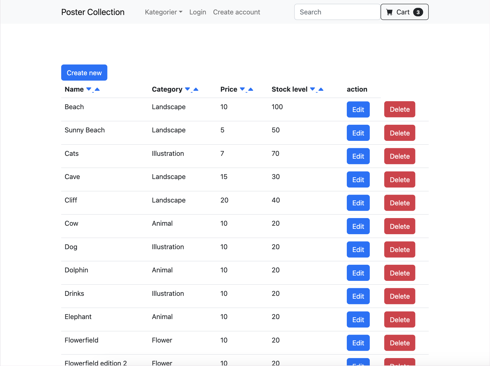
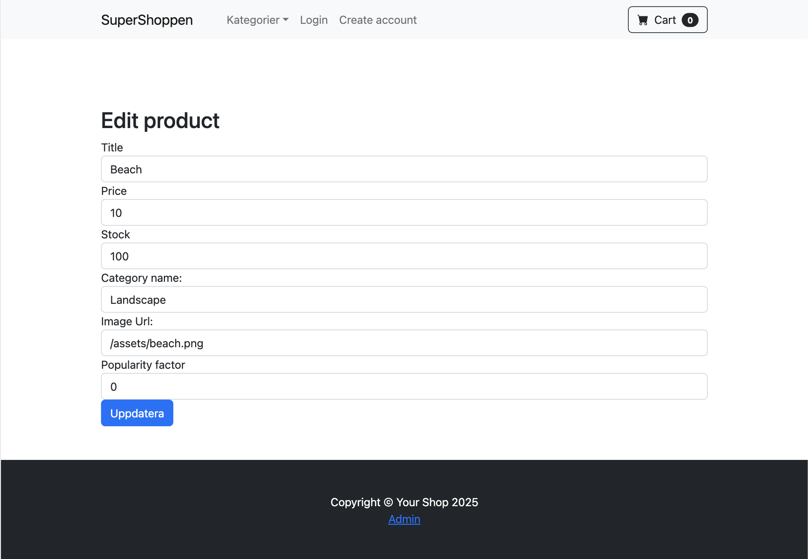
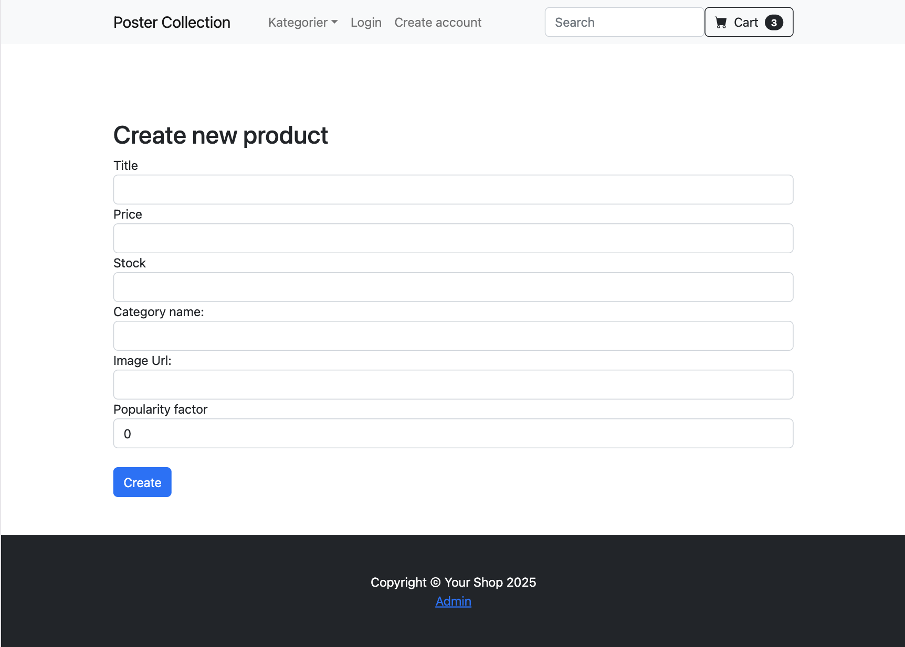
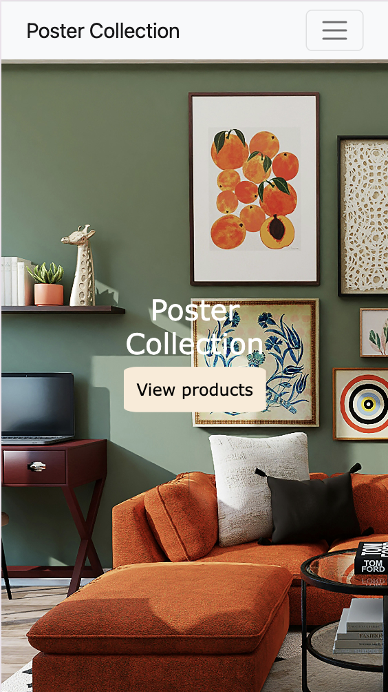
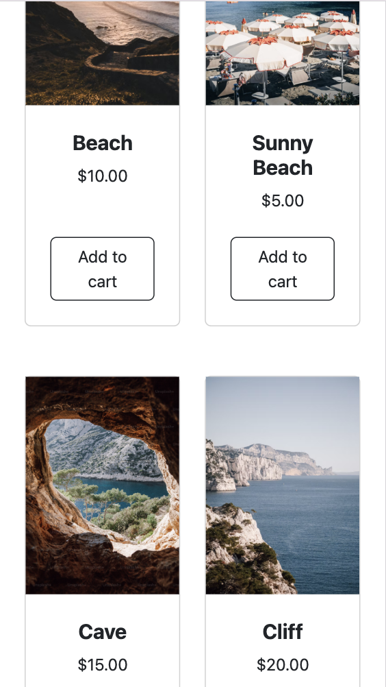

# Poster Collection 
Poster webshop - school  assignment

## Technique
- HTML 
- CSS
- PHP
- JavaScript
- MySQL

## Assignment Objectives 
- Planning, architecture, and system design for dynamic e-commerce applications. 
- Use of design patterns and their impact on code quality and structure. 
- Plan and develop an e-commerce platform.
- Select, design, and customize databases based on requirements.
- Design systems and codebases following architectural principles and design patterns.

## Requirements
- MySQL Database
    - Normalized MySQL database with relevant tables (products, categories, etc.)

-  Start Page
    - Displays 10 popular products sorted by a popularityFactor attribute

-  Categories	
    - Each product belongs to one category

- Product Page
    - Click on a product to view full details

- Category Listing
    - Sidebar or menu lists all categories; clicking displays products for that category

- Global Search	
    - Search available across the whole site

- Sorting	
    - Search and category listings are sortable by name and price (ascending & descending)

## DEMO 

## Installation

1. Clone this repository

    https://github.com/jessikarl/posterShop-php.git 

2. Navigate to the project 

    cd posterShop-php

3. Install dependencies 
    1. View
    2. Command Palette 
    3. Composer install 

4. Set up database (opional)
    1. Create a database
    2. Create a .env file 

4. Run the application
    1. Run 
    2. Start debugging 
    3. Launch built-in server and debug
